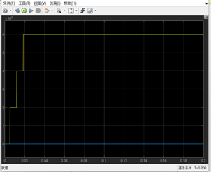
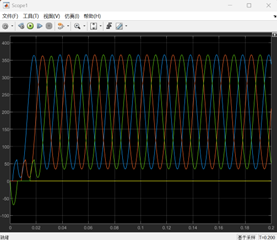
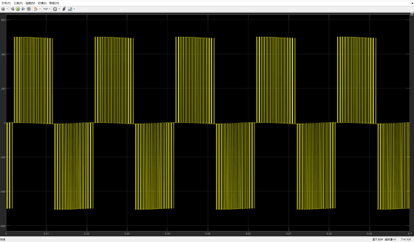
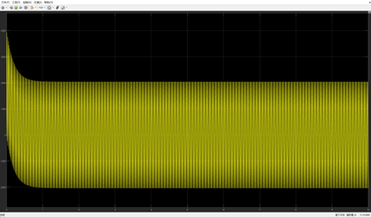
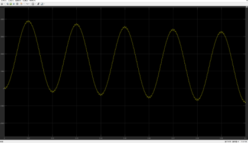
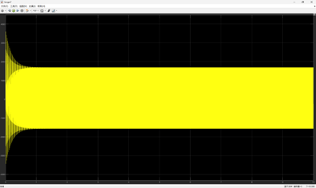
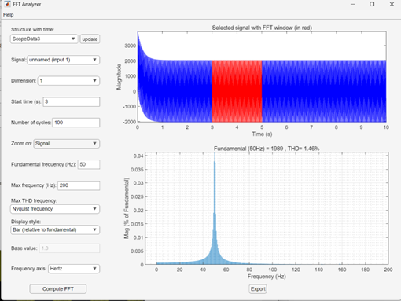

# 三相逆变电路仿真研究：晶闸管有源逆变 vs IGBT-PWM逆变

## 📑 目录
- [项目简介](#-项目简介)
- [硬件/软件平台](#-硬件软件平台)
- [项目内容](#-项目内容)
  - [1. 晶闸管三相全控桥有源逆变](#1-晶闸管三相全控桥有源逆变)
  - [2. IGBT三相电压型桥式逆变（SPWM）](#2-igbt三相电压型桥式逆变spwm)
- [对比分析与结论](#-对比分析与结论)
- [遇到的问题与解决](#-遇到的问题与解决)

---

## 📌 项目简介
本项目对两种典型的逆变拓扑进行了仿真研究与对比分析：
- **三相全控桥有源逆变电路**（晶闸管，α=150°）：研究传统相控逆变的工作原理及电能质量问题
- **三相电压型桥式逆变电路**（IGBT，SPWM调制）：研究现代高频PWM逆变技术及其谐波特性

## 🛠️ 硬件/软件平台
- **仿真软件**：MATLAB/Simulink
- **主要器件**：晶闸管、IGBT、平波电抗器、三相电源
- **分析工具**：FFT Analyzer、Powergui

## 📊 项目内容

### 1. 晶闸管三相全控桥有源逆变

#### 1.1 电路设计
- 直流侧平波电感计算：`Ld ≈ 0.05H`（满足电流纹波<20%）
- 晶闸管选型：
  - 额定电压：1200V（2倍裕量）
  - 额定电流：5A（ITAV）/ 8A（ITRMS）

#### 1.2 仿真结果

**直流侧电流Id波形**
| 波形1 | 波形2 |
|-------|-------|
|  |  |

*电流纹波<20%，满足设计要求*

**其他指标**
- 输入电流THDi：25.38%（谐波含量较高，需加滤波器）
- 功率因数PF：0.0381（极低，反映相控逆变的固有缺陷）

#### 1.3 关键代码/模型
### 平波电感计算公式

根据三相全控桥的纹波要求，平波电感 \( L_d \) 由下式确定：

\[
L_d \approx \frac{U_{ripple(6f)}}{6 \cdot \omega \cdot \Delta I_d}
\]

其中：
- \( U_{ripple(6f)} \)：直流电压中6倍频纹波分量的峰值（V）
- \( \omega = 2\pi f \)：电网角频率（rad/s）
- \( \Delta I_d = 20\% \cdot I_d \)：允许的电流纹波幅度（A）

**参数取值：**
- 纹波电压：\( U_{ripple(6f)} = 30 \, \text{V} \)（从仿真波形读取）
- 直流电流：\( I_d = 6 \, \text{A} \)，\( \Delta I_d = 0.2 \times 6 = 1.2 \, \text{A} \)
- 电网频率：\( f = 50 \, \text{Hz} \)，\( \omega = 2\pi \times 50 \approx 314.16 \, \text{rad/s} \)

**计算结果：**
\[
L_d \approx \frac{30}{6 \times 314.16 \times 1.2} \approx 0.05 \, \text{H}
\]

**[返回目录](#-目录)**

### 2. IGBT三相电压型桥式逆变（SPWM）

#### 2.1 参数设计
- 开关频率 fs = 4950Hz
- 滤波电感 L = 15mH
- 滤波电容 C = 3.3μF
- 截止频率 fc = 715Hz（满足 fc = (1/5~1/10)fs 的设计要求）

#### 2.2 仿真波形
| 项目 | 波形 | 特征 |
|------|------|------|
| 输出线电压 u_UV |  | SPWM典型波形，无三次谐波 |
| 输出电流 i_u |   | 接近正弦波，电感平滑作用 |
| 直流侧电流 id |  | 脉冲性，电容吸收脉动分量 |

#### 2.3 谐波分析

- 谐波能量集中在开关频率（4950Hz）及其倍数附近
- 符合PWM调制理论，低频谐波含量低

**[返回目录](#-目录)**

## 🔍 对比分析与结论

| 指标 | 晶闸管有源逆变 | IGBT-PWM逆变 |
|------|---------------|--------------|
| 控制方式 | 相控（α=150°） | 高频SPWM |
| THDi | 25.38% | 较低（主要集中在高频段） |
| 功率因数 | 0.0381 | 接近1 |
| 适用场景 | 大功率、低成本 | 高性能、并网应用 |

**[返回目录](#-目录)**

## 🧪 遇到的问题与解决

1. **问题**：仿真初期Id始终为0
   **解决**：放弃Universal Bridge模块，改用6个独立Thyristor手动搭建电桥，解决了模块内部参数不兼容问题

2. **问题**：PLL锁相环维度错误
   **解决**：用Demux模块将Vabc三相向量降维为单相标量Va，再输入给PLL

3. **问题**：晶闸管脉冲连接失败
   **解决**：用Demux将Thyristor 6-Pulse Generator的P信号分配给6个独立的G端口

**[返回目录](#-目录)**

