# 控制系统稳定性与频域分析研究

## 📑 目录
- [项目简介](#-项目简介)
- [实验一：典型环节研究](#-实验一典型环节研究)
- [实验二：二阶系统运动规律](#-实验二二阶系统运动规律)
- [实验三：三阶系统稳定性研究](#-实验三三阶系统稳定性研究)
- [实验四：控制系统频域分析](#-实验四控制系统频域分析)

---

## 📌 项目简介
本系列实验围绕自动控制原理的核心内容展开，涵盖：
- **典型环节**：比例、惯性、积分、比例积分环节的实测与理论对比
- **二阶系统**：参数变化对系统响应的影响
- **三阶系统**：临界稳定条件的理论计算与实验验证（劳斯判据）
- **频域分析**：Bode图、相位裕度、谐振频率等频域指标的测量

**亮点**：理论计算 vs 实测值对比 + 参数扫描 + 多方法验证

---

## 📊 实验一：典型环节研究

### 1.1 比例环节
| 输入电阻R0 | 反馈电阻R1 | 输入电压Ui | 比例系数 |
|-----------|-----------|------------|----------|
|           |           |            | 理论K | 实测K |
| 200K | 100K | 4V | 0.5 | 0.5019 |
| 200K | 200K | 4V | 1.0 | 1.0076 |

**波形图**：
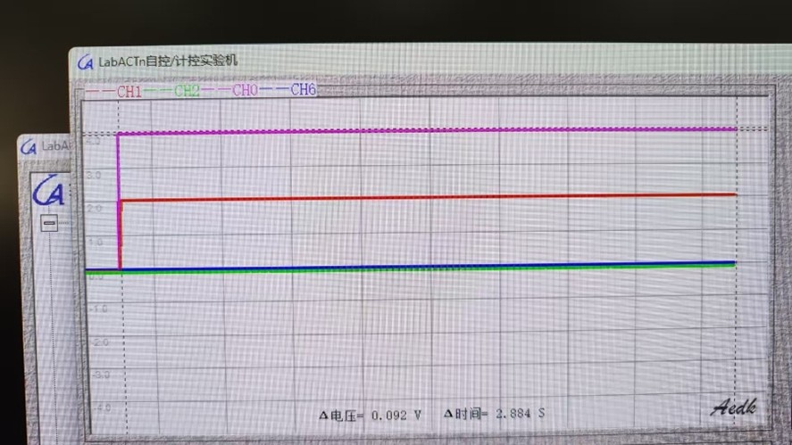
*图1：R1=100K时的输入输出波形*

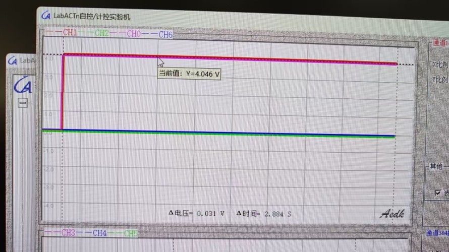
*图2：R1=200K时的输入输出波形*

### 1.2 惯性环节
| R0 | R1 | C | Ui | 理论K | 实测K | 理论T(s) | 实测T(s) |
|----|----|---|----|-------|-------|---------|---------|
| 200K | 200K | 2μ | 4V | 1 | 1 | 0.4 | 0.44 |
| 200K | 200K | 1μ | 4V | 1 | 1 | 0.2 | 0.23 |

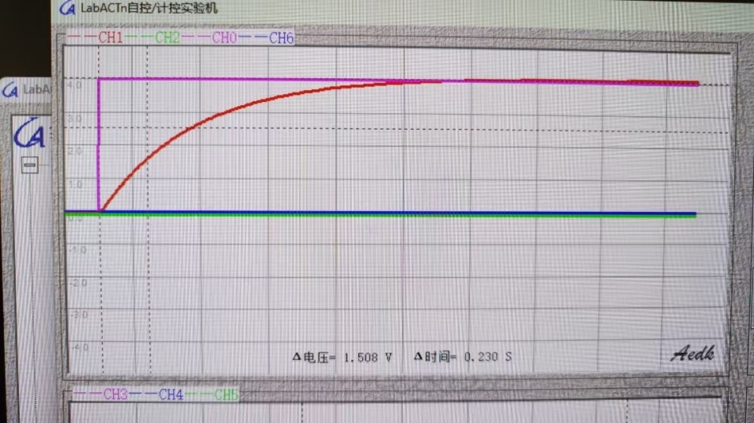
*图3：C=2μ时的响应波形*

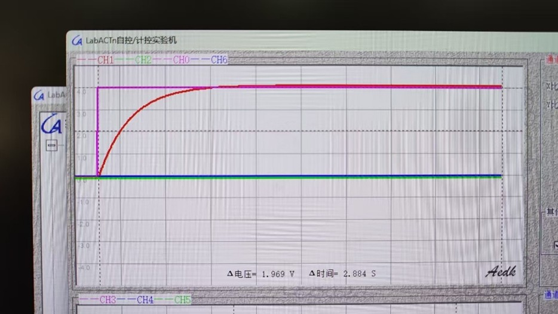
*图4：C=1μ时的响应波形*

### 1.3 积分环节
| R0 | C | Ui | 理论Ti | 实测Ti |
|----|---|----|--------|--------|
| 500K | 1μ | 1V | 0.5 | 0.612 |
| 500K | 2μ | 1V | 1.0 | 1.138 |

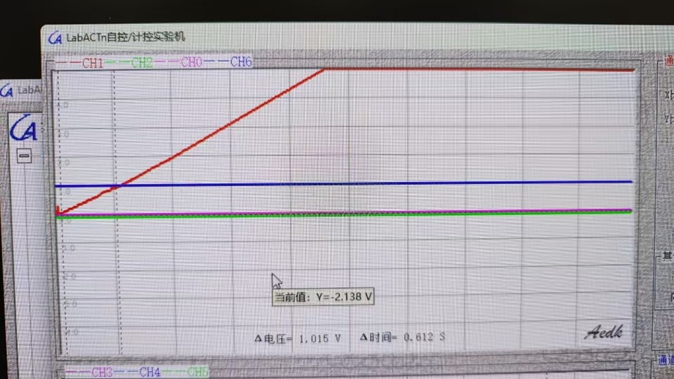
*图5：C=1μ时的积分波形*

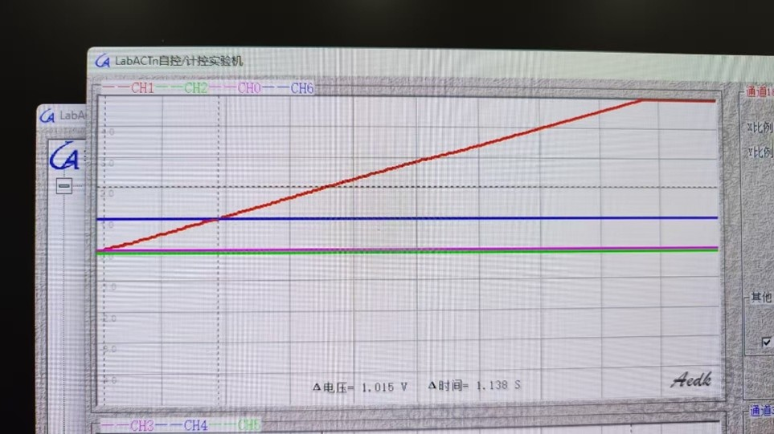
*图6：C=2μ时的积分波形*

### 1.4 比例积分环节
| R0 | R1 | C | Ui | 理论K | 实测K | 理论T | 实测T |
|----|----|---|----|-------|-------|-------|-------|
| 500K | 500K | 1μ | 1V | 1 | 1 | 0.5 | 0.563 |
| 500K | 500K | 2μ | 1V | 1 | 1 | 1.0 | 1.187 |

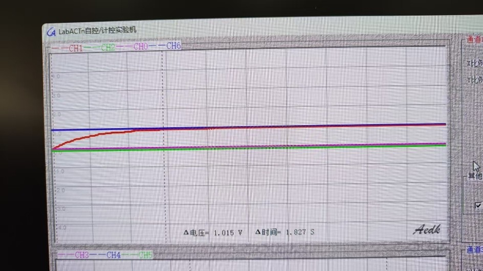
*图7：C=1μ时的PI响应*

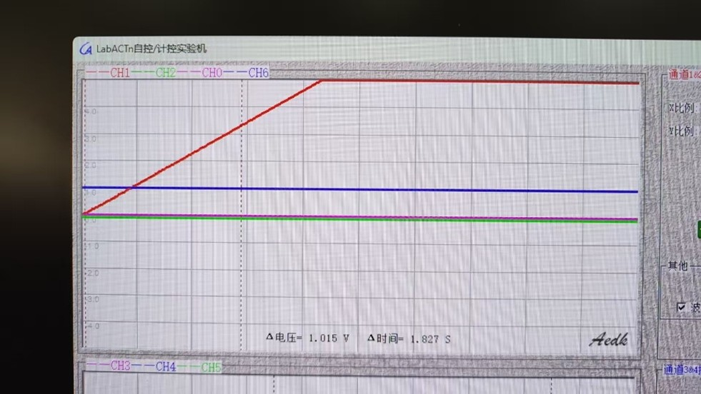
*图8：C=2μ时的PI响应*

---

## 📈 实验二：二阶系统运动规律

### 不同电阻对响应的影响
| R值 | 响应特征 |
|-----|----------|
| 2K | 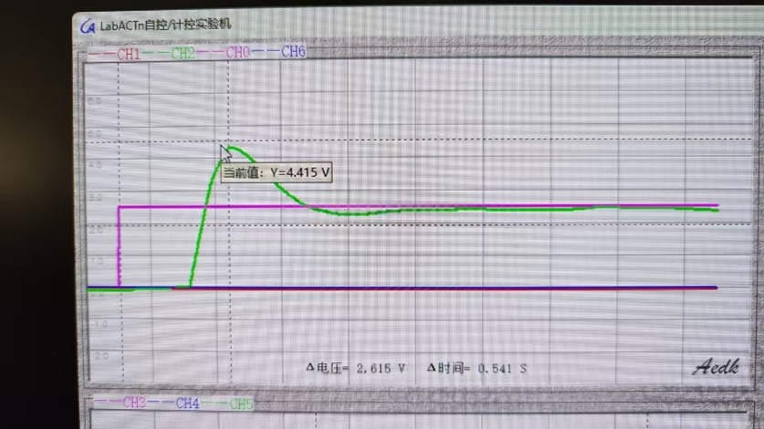 |
| 4K | 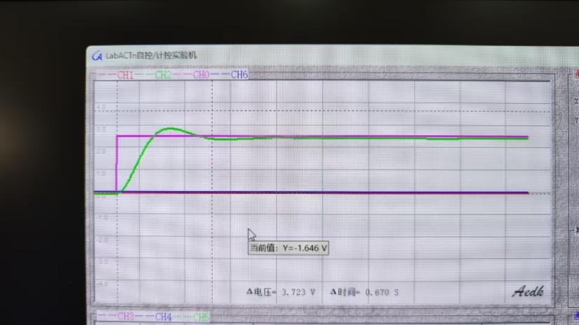 |
| 10K | 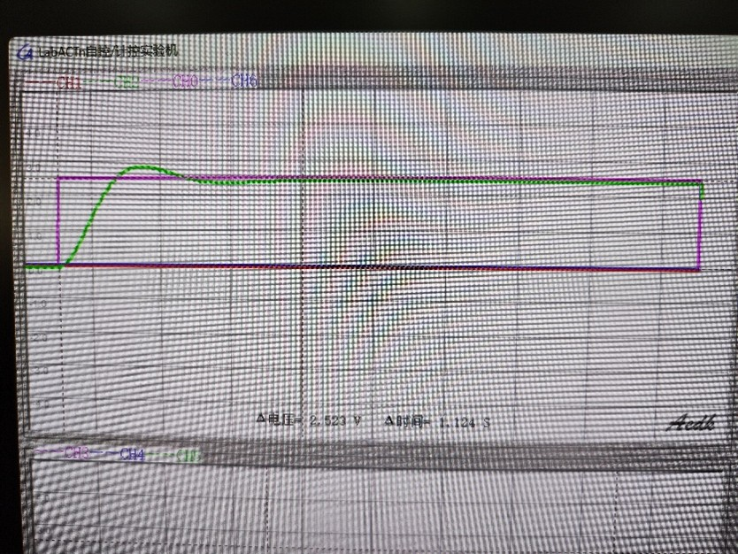 |
| 40K | 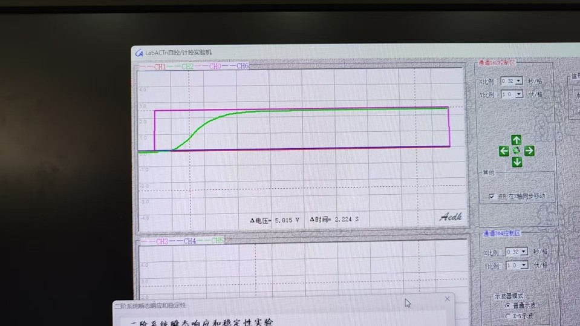 |
| 70K | 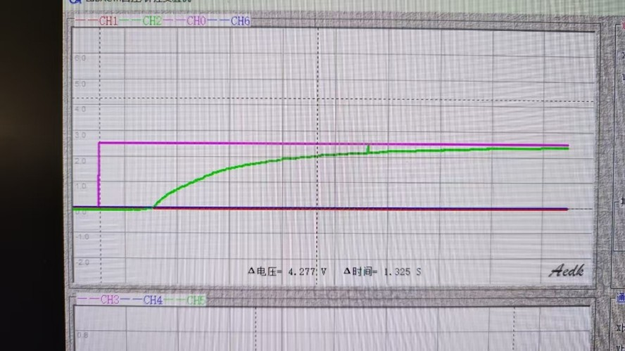 |

### 不同电容对响应的影响
| C2值 | 响应特征 |
|------|----------|
| 1μ |  |
| 2μ | 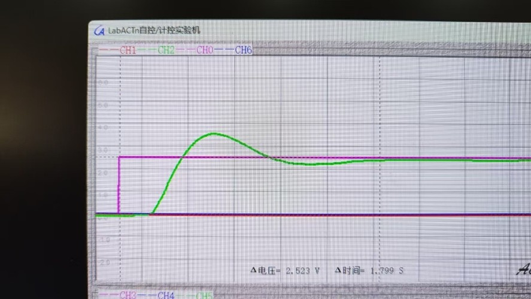 |
| 3μ | 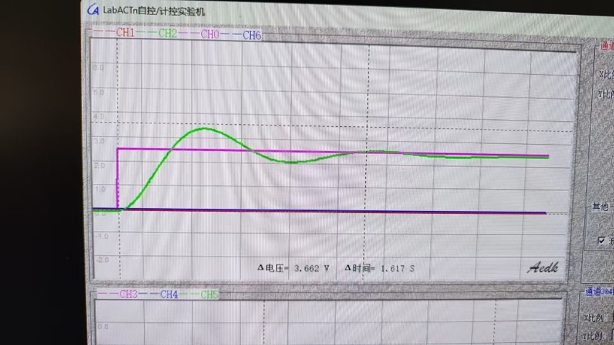 |

---

## 🔬 实验三：三阶系统稳定性研究

### 临界稳定条件验证
| T1 | T2 | 临界R(计算) | 临界R(实测) | 误差 |
|----|----|-------------|-------------|------|
| 0.1 | 0.5 | 41.67k | 35.7k | 14.3% |
| 0.1 | 1.0 | 45.45k | 44k | 3.2% |
| 0.2 | 0.5 | 71.43k | 60k | 16.0% |
| 0.2 | 1.0 | 83.33k | 72k | 13.6% |

### 不同参数下的响应波形
| 参数 | 波形 |
|------|------|
| T1=0.1, T2=0.5 | 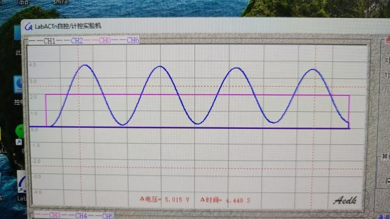 |
| T1=0.1, T2=1.0 | 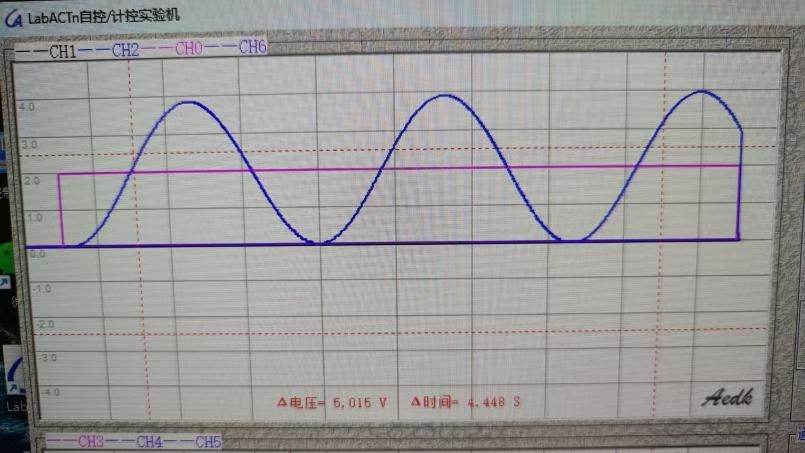 |
| T1=0.2, T2=0.5 | 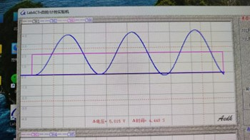 |
| T1=0.2, T2=1.0 | 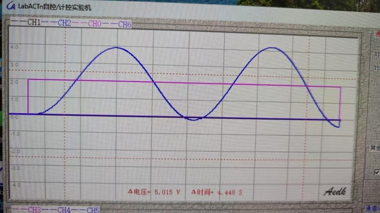 |

### 思考题摘要
**三阶系统的稳定性取决于什么？**
> 三阶系统的稳定性主要取决于其特征方程的根分布。可通过劳斯判据分析：所有系数必须同号且非零，劳斯表第一列所有元素为正。若特征方程的根均具有负实部（位于左半复平面），则系统稳定。

---

## 📡 实验四：控制系统频域分析

### 4.1 一阶惯性环节频率特性
| 时间常数T | 转折频率(实测) | 转折频率(计算) |
|-----------|----------------|----------------|
| 0.1 | 9.9 Hz | 10 Hz |
| 0.2 | 5 Hz | 5 Hz |
| 0.3 | 3.2 Hz | 3.3 Hz |

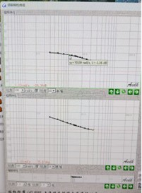
*图：T=0.1时的频率响应*

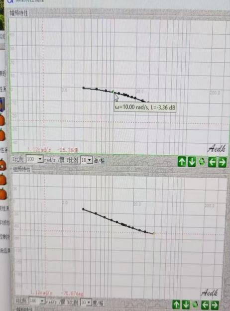
*图：T=0.2时的频率响应*

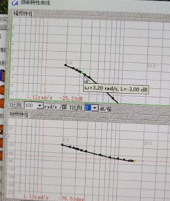
*图：T=0.3时的频率响应*

### 4.2 二阶系统频域特性（闭环）
| K | T | Ti | 谐振频率(计算) | 谐振频率(实测) | 谐振峰值(计算) | 谐振峰值(实测) |
|---|---|----|----------------|----------------|----------------|----------------|
| 25 | 0.1 | 1 | 13.66 | 14 | 2.37 dB | 4.03 dB |
| 25 | 0.3 | 1 | 12.69 | 12 | 8.27 dB | 10.65 dB |
| 20 | 0.1 | 0.5 | 18.71 | 18 | 4.08 dB | 7.10 dB |
| 20 | 0.1 | 0.2 | 30.82 | 30 | 6.33 dB | 9.45 dB |

### 4.3 二阶系统频域特性（开环）
| K | T | Ti | 穿越频率(计算) | 穿越频率(实测) | 相位裕度(计算) | 相位裕度(实测) |
|---|---|----|----------------|----------------|----------------|----------------|
| 25 | 0.1 | 1 | 14.188 | 14 | 34.9° | 33.1° |
| 25 | 0.3 | 1 | 8.821 | 9 | 20.73° | 18.8° |
| 20 | 0.1 | 0.5 | 18.791 | 18 | 28.02° | 26.3° |
| 20 | 0.1 | 0.2 | 30.844 | 30 | 17.952° | 16.1° |

### 4.4 MATLAB Bode图验证
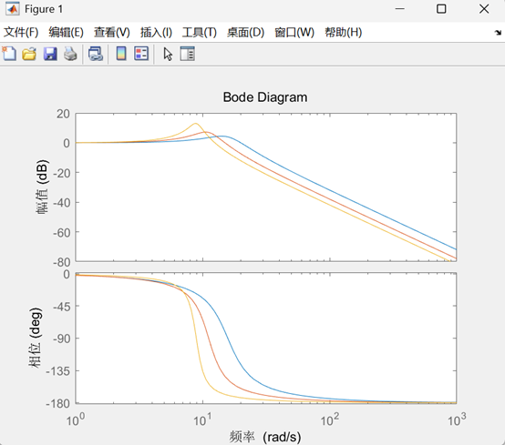
*图：不同参数下的Bode图对比（MATLAB绘制）*

### 思考题摘要
**频域指标与动态性能指标的关系：**
> 二阶系统的频域性能指标和时域动态性能指标之间存在直接的对应关系。频域特性中的峰值和相位裕度能够直观反映系统的稳定性和响应速度。当系统在频域出现明显的谐振峰时，说明其阻尼较小，这会导致时域响应中出现较大的超调量和振荡。

---

## 📬 返回总目录
[🔙 返回作品集主页面](../README.md)
