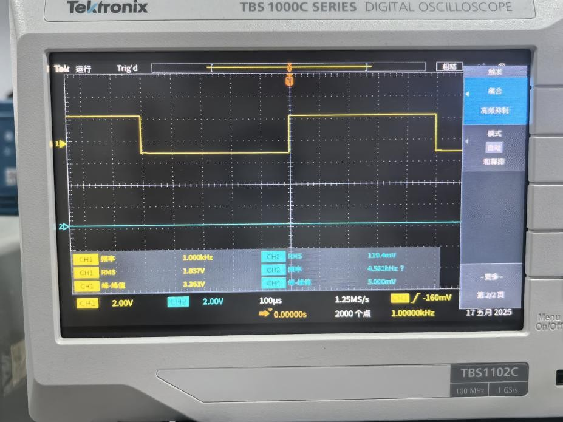
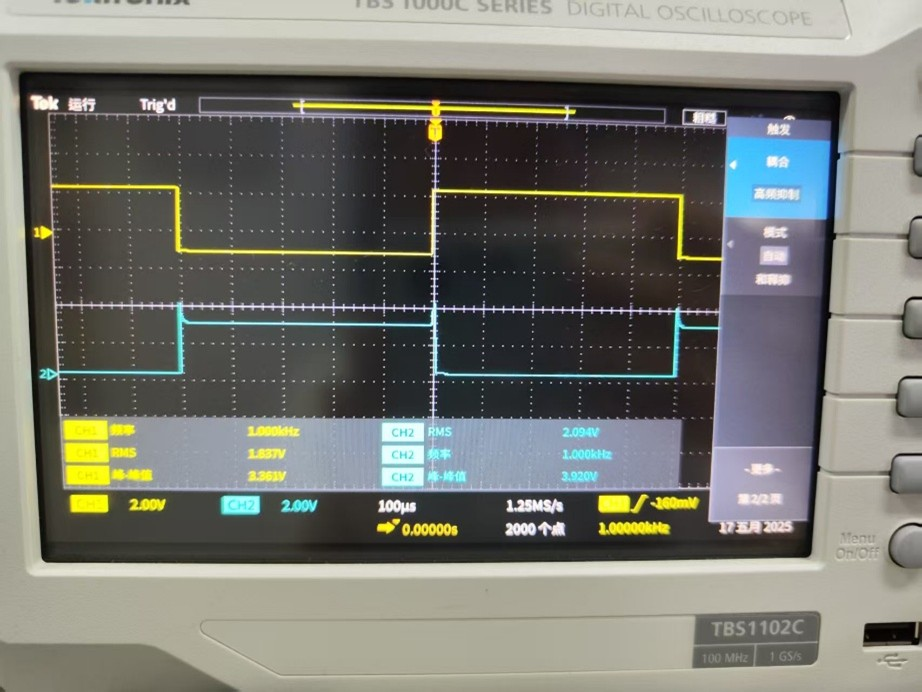
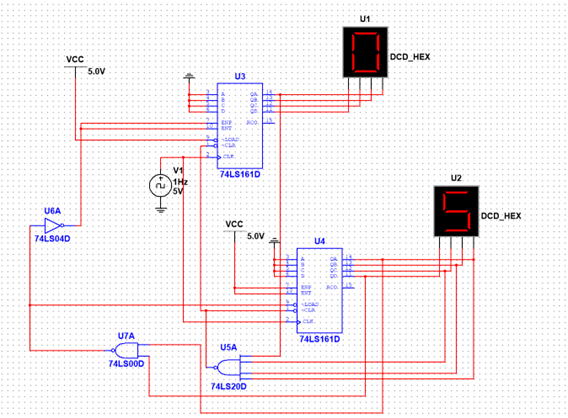
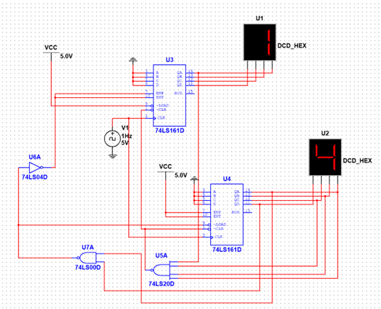
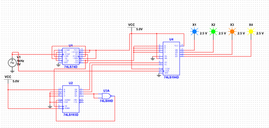
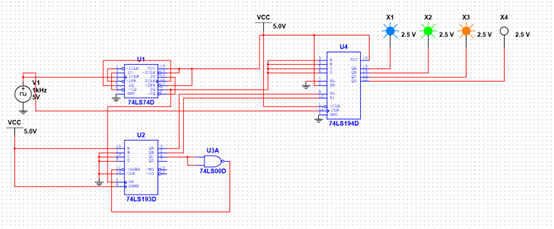
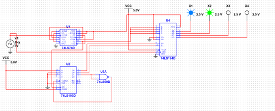
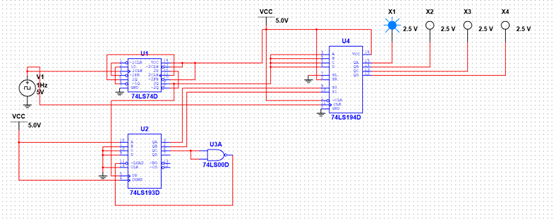
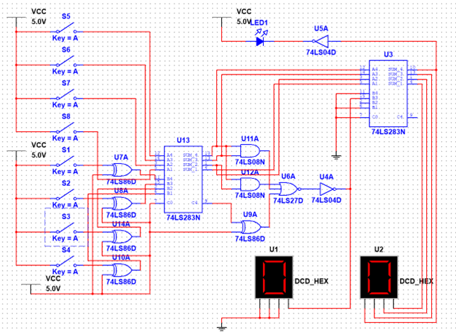
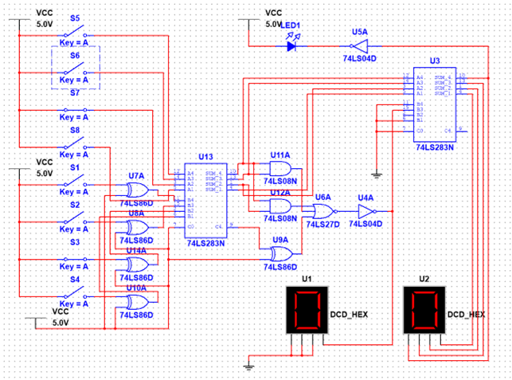

# 数字电子技术实验作品集

## 📑 目录
- [项目简介](#-项目简介)
- [实验一：门电路逻辑测试](#-实验一门电路逻辑测试)
- [实验二：FPGA任意进制计数器](#-实验二fpga任意进制计数器)
- [实验三：FPGA彩灯循环电路](#-实验三fpga彩灯循环电路)
- [实验四：组合逻辑与触发器应用](#-实验四组合逻辑与触发器应用)
---

## 📌 项目简介
本系列实验涵盖数字电子技术的核心内容：
- **门电路逻辑测试**：与非门控制输出波形分析
- **FPGA计数器设计**：基于74161的任意进制计数器
- **FPGA彩灯循环**：基于74193/74194的彩灯控制电路
- **组合逻辑电路**：半加器、全加器、触发器、加减运算电路等

**亮点**：基础门电路 + 中规模集成电路 + FPGA应用

---

## 🔌 实验一：门电路逻辑测试（74LS00）

### 与非门控制输出波形

**实验电路**：用74LS00搭建，B端控制A信号的传输

| B=0时输出 | B=1时输出 |
|-----------|-----------|
|  |  |
| *B=0时，输出Y恒为高电平* | *B=1时，输出Y与输入A反相* |

**分析**：当B=0时，与非门被封锁，输出恒为1；当B=1时，与非门打开，输出为A的反相。这是门电路实现信号控制的典型应用。

---

## 💻 实验二：FPGA任意进制计数器

### 系统架构
```
时钟信号(CLK) → 分频器 → 计数器(74161) → 译码器(74LS47) → 七段数码管
```

### 设计原理
- **74161计数器**：4位同步二进制计数器，具有同步预置、异步清零功能
- **分频器**：降低时钟频率，适配数码管显示
- **74LS47译码器**：将BCD码转换为七段数码管驱动信号

### 仿真原理图
<div align="center">
  
  
</div>
<div align="center">
  *完整系统原理图（分频+计数+译码+显示）*
</div>

### 仿真结果
<div align="center">
  
</div>
<div align="center">
  *计数器仿真波形图*
</div>

### 大容量计数器设计方法
| 方法 | 原理 | 特点 |
|------|------|------|
| 同步级联 | 共用时钟，前级RCO作为后级使能 | 速度快，无级联延迟，逻辑稍复杂 |
| 异步级联 | 前级RCO作为后级时钟 | 电路简单，有级联延迟，适合低速 |

---

## ✨ 实验三：FPGA彩灯循环电路

### 系统架构
```
时钟信号 → 分频器 → 计数器(74193) → 控制逻辑 → 移位寄存器(74194) → 4个彩灯
```

### 核心器件
- **74193计数器**：4位同步可逆计数器，控制循环方向
- **74194移位寄存器**：4位双向移位寄存器，实现流水效果
- **分频器**：将高频时钟降频，适配人眼观察

### 仿真功能
<div align="center">
  
  
</div>
<div align="center">

</div>

<div align="center">
  
  
</div>
<div align="center">

</div>

### 移位寄存器扩展应用
- **数据串并转换**：UART接收等场景
- **并串转换**：SPI通信等场景
- **脉冲延迟**：信号时序调整
- **伪随机数生成**：LFSR反馈电路

---

## 🔧 实验四：组合逻辑与触发器应用

### 4.1 组合逻辑电路设计
| 实验内容 | 实现方式 | 说明 |
|---------|---------|------|
| 半加器 | 与非门、异或门 | 验证半加器逻辑功能 |
| 全加器 | 与非门、异或门、与或非门 | 多种门电路实现对比 |

### 4.2 触发器应用
| 触发器类型 | 芯片 | 应用 |
|-----------|------|------|
| RS触发器 | 74LS00 | 基本存储单元 |
| D触发器 | 74LS74 | 数据锁存、四分频电路 |
| JK触发器 | 74LS112 | 功能最全的触发器 |

### 4.3 FPGA加减运算电路
- **4位二进制全加器**（74LS283）
- **数值比较器**（74LS85）用于溢出检测
- **数据选择器**（74LS157）实现加减模式切换

**仿真结果**：
<div align="center">
  
  
  
</div>
<div align="center">
  *加减运算电路仿真（初始状态 / 加法2+4 / 减法2-2）*
</div>

---

## 📬 返回总目录
[🔙 返回作品集主页面](../README.md)
